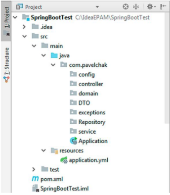

# VeterinaryDatabaseMVC
##Summary
1. For the developed database in laboratory work 5, implement back-end project using Spring Data JPA technology for work with MySQL database.
2. Based on the results of the work performed, draw up a report and submit it.
   The report should contain the following information:
    - ER-diagram of the database;
    - Java program code for the implementation of controllers, services and repositories (if the code is too much, then demonstrate program code only partially).
    - Link to github with flooded project.
    - Conclusion.
##Steps
1. Use the database developed in the laboratory 5
2. Back-end project using Spring Boot technology is created as a Maven project with a connection to MySQL.
3. The structure of the project should look something like this:
    
4. Controllers must process requests for CRUD operations and return the required data in the form of DTOs with links (web addresses) as recommended by HATEOAS.
5. Services must contain basic business logic to work with data.
6. Repositories can contain additional methods (automatically generated or with JPQL queries) if necessary to work with data.
7. Implement client work with data through Swagger:
   - output of data from tables;
   - insert data into the table;
   - updating data in tables.
   - deleting data from the table;
   - M:1 communication output, ie, for example, for
   - each city to bring out the people who live in it;
   - output of data from the docking table M: M, ie output
   - for each subject in one table, all subjects in the other
   - tables that are attached to it.
   - implement insert / delete in / from the docking table communication M: M.
8. The implemented project should be uploaded to GitHub. 